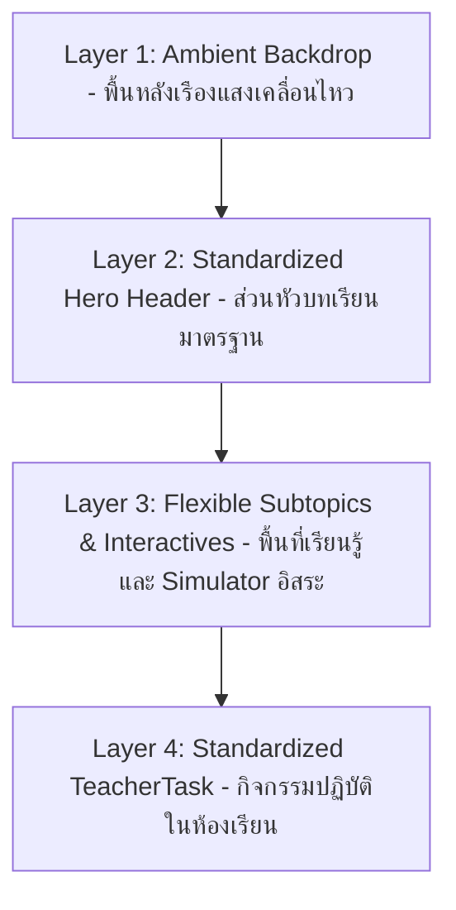

# LMS-React Frontend Design & System Architecture Standards (PipelinePro Style)

เอกสารนี้คือ "Source of Truth" และ "Strict Guidelines" สำหรับ AI Agent ในการพัฒนา เพื่อรักษาความสมบูรณ์ของสถาปัตยกรรมและมาตรฐาน UI/UX ของระบบ LMS-React ให้เป็นมาตรฐานเดียวกัน 100% โดยอิงตามระบบการออกแบบ **PipelinePro**

---

## 1. Project Context & Architecture

LMS-React คือระบบจัดการการเรียนรู้แบบ Single Page Application (SPA) ที่เน้นการทำ "In-browser Simulation" สำหรับวิชาสายโปรแกรมเมอร์ (PY21910, OOP21910, SQL21901) โดยนำโครงสร้างและการควบคุมส่วนต่อประสานผู้ใช้ที่มีความหนักแน่นและเป็นสัดส่วนของ **PipelinePro** มาประยุกต์ใช้เพื่อความเป็นมืออาชีพและจัดการข้อมูลที่หนาแน่นได้อย่างชัดเจน

- **Framework**: React 18+ (Functional Components & Hooks)
- **Build Tool**: Vite
- **Styling**: Tailwind CSS (Strictly no external CSS - อ้างอิงตามค่าสเปกสีและ Typography ของ PipelinePro)
- **Icons**: lucide-react (size=20, strokeWidth=2)
- **State**: Local State focus for Simulators (ห้ามใช้ Global State สำหรับ Simulator รายชิ้น)
- **Directory Structure**:
  - `src/components/interactive/`: ที่อยู่ของ Simulator/Interactives ทั้งหมด
  - `src/data/`: ที่อยู่ของไฟล์หลักสูตร (oopCourse.js, sqlCourse.js)
  - `docs/`: ไฟล์ Markdown สำหรับเนื้อหาภาคทฤษฎี

---

## 2. PipelinePro Design Tokens

### 2.1 Color Palette (Strict Hex Codes & Tailwind Mappings)

| Token          | Hex Code  | Tailwind Usage | Description / Usage                                                        |
| :------------- | :-------- | :------------- | :------------------------------------------------------------------------- |
| **Primary**    | `#4F46E5` | `indigo-600`   | Actions หลัก, สถานะของ Pipeline ที่ใช้งานอยู่, ปุ่ม CTA สำคัญ              |
| **Secondary**  | `#06B6D4` | `cyan-500`     | ไฮเปอร์ลิงก์, ไฮไลต์รอง, สัญลักษณ์แสดงมูลค่าหรือจุดเน้น                    |
| **Tertiary**   | `#F97316` | `orange-500`   | สัญลักษณ์แจ้งเตือนความเร่งด่วน, งานที่ใกล้ครบกำหนด, ลีดการเรียนรู้เร่งด่วน |
| **Background** | `#FAFAFA` | `[#FAFAFA]`    | พื้นหลังหลักของแอปพลิเคชัน (App-level Canvas)                              |
| **Surface**    | `#FFFFFF` | `white`        | พื้นผิวของโมดูลาร์ เช่น การ์ด, หน้าต่างป็อปอัป (Modals), และแผงรายละเอียด  |
| **Success**    | `#22C55E` | `green-500`    | แจ้งผลลัพธ์ผ่านด่านสำเร็จ, การกระทำเชิงบวก                                 |
| **Warning**    | `#F59E0B` | `amber-500`    | การแจ้งเตือนที่ต้องการความระมัดระวัง                                       |
| **Error**      | `#EF4444` | `red-500`      | ข้อผิดพลาด, การกระทำที่เป็นอันตรายหรือลบข้อมูล, การทดสอบ Simulator ล้มเหลว |
| **Info**       | `#4F46E5` | `indigo-600`   | ข้อมูลทั่วไปและการแนะแนวระบบ                                               |

### 2.2 Typography Scale & Thai Rules

- **Font Family**: Outfit (สำหรับ Headlines / Display), Inter (สำหรับ Body / UI Elements), Source Code Pro (สำหรับ Code / Mono font), Noto Sans Thai (ภาษาไทยสำรอง)
- **Thai Rule**: บังคับใช้ `leading-relaxed` (line-height: 1.625) หรือ `leading-loose` สำหรับภาษาไทยทุกจุดเพื่อป้องกันสระและวรรณยุกต์ทับซ้อนกัน
- **Scale Definition**:
  - **Display**: Outfit `text-[52px] font-bold leading-[1.1] tracking-[-0.02em]`
  - **Headline**: Outfit `text-[38px] font-bold leading-[1.2] tracking-[-0.015em] text-zinc-900`
  - **Subhead**: Outfit `text-[26px] font-semibold leading-[1.3] tracking-[-0.01em] text-zinc-900`
  - **Body Large**: Inter `text-[18px] font-normal leading-[1.6] text-zinc-600`
  - **Body**: Inter `text-[15px] font-normal leading-[1.6] text-zinc-600`
  - **Body Small**: Inter `text-[14px] font-normal leading-[1.5] text-zinc-500`
  - **Caption**: Inter `text-[12px] font-medium leading-[1.4] tracking-[0.01em] text-zinc-500`
  - **Overline**: Inter `text-[11px] font-bold leading-[1.2] tracking-[0.09em] uppercase text-zinc-500`
  - **Code**: Source Code Pro `text-[14px] font-mono leading-[1.5] text-zinc-800`

### 2.3 Spacing & Layout

- **Base Unit**: `4px`
- **Component Padding**: Small: `8px` (p-2), Medium: `12px` (p-3), Large: `16px` (p-4)
- **Section Spacing**: Mobile: `24px` (my-6), Tablet: `40px` (my-10), Desktop: `56px` (my-14)
- **Container Max**: 1280px (`max-w-7xl`)

### 2.4 Border Radius

- **None (`rounded-none`)**: `0px`
- **Small (`rounded-sm`)**: `4px`
- **Medium (`rounded-lg`)**: `8px`
- **Large (`rounded-xl`)**: `12px`
- **XL (`rounded-3xl`)**: `20px`
- **Full (`rounded-full`)**: `9999px`

### 2.5 Elevation & Shadow

- **Subtle**: `shadow-[0_1px_2px_0_rgba(24,24,27,0.05)]`
- **Medium**: `shadow-[0_4px_6px_-1px_rgba(24,24,27,0.07),0_2px_4px_-2px_rgba(24,24,27,0.05)]`
- **Large**: `shadow-[0_10px_15px_-3px_rgba(24,24,27,0.08),0_4px_6px_-4px_rgba(24,24,27,0.04)]`
- **Overlay**: `shadow-[0_20px_25px_-5px_rgba(24,24,27,0.12),0_8px_10px_-6px_rgba(24,24,27,0.06)]`
- **Drag**: `shadow-[0_12px_24px_-4px_rgba(79,70,229,0.15)]`

---

## 3. Component Standards (PipelinePro Style)

### 3.1 Buttons

ปุ่มต้องมีขนาดและสไตล์ตามที่กำหนดอย่างเคร่งครัด:

- **Primary (Filled)**: `bg-[#4F46E5] text-white hover:bg-[#4338CA] active:bg-[#3730A3] active:scale-98 font-semibold text-sm rounded-[8px] px-[18px] py-2 transition-all`
- **Secondary (Outline)**: `bg-transparent text-[#4F46E5] border border-[#4F46E5] hover:bg-[#EEF2FF] active:scale-98 font-semibold text-sm rounded-[8px] px-[18px] py-2 transition-all`
- **Ghost**: `bg-transparent text-[#71717A] hover:bg-[#F4F4F5] hover:text-[#18181B] rounded-[8px] px-3 py-2 transition-all`
- **Destructive**: `bg-[#EF4444] text-white hover:bg-[#DC2626] active:scale-98 font-semibold text-sm rounded-[8px] px-[18px] py-2 transition-all`
- **Button Sizes & Heights**:
  - **Small**: ความสูง `32px` (h-8)
  - **Medium**: ความสูง `38px` (h-[38px]) _[เป็นค่าเริ่มต้น]_
  - **Large**: ความสูง `46px` (h-[46px])
- **Disabled State**: ค่าความโปร่งใสลดลงเหลือ 40% (`opacity-40`) และใช้เมาส์แบบห้ามกด (`cursor-not-allowed`)

### 3.2 Inputs & Forms

- **Text Input**:
  ```html
  <input class="w-full h-[38px] px-3 py-2 bg-white border border-[#E4E4E7] text-[#18181B] placeholder-[#A1A1AA] text-sm rounded-[8px] focus:outline-none focus:border-[#4F46E5] focus:ring-3 focus:ring-[#4F46E5]/12 disabled:bg-[#FAFAFA] disabled:opacity-50 transition-all" />
  ```
- **Label**: `block text-[13px] font-medium text-[#3F3F46] mb-1`
- **Helper text**: `text-xs text-[#71717A] mt-1`
- **Error border & message**: `border-[#EF4444] focus:ring-[#EF4444]/12` พร้อมข้อความสีแดงขนาด 12px

### 3.3 Checkboxes, Radios & Tooltips

- **Checkbox**:
  ```jsx
  <div className="flex items-center pl-2">
    <input type="checkbox" className="w-4 h-4 border-[1.5px] border-[#D4D4D8] rounded-[4px] text-[#4F46E5] focus:ring-[#4F46E5] focus:ring-opacity-20 cursor-pointer disabled:opacity-40" />
    <span className="pl-2 text-sm font-sans text-slate-700">Checkbox Label</span>
  </div>
  ```
- **Radio Button**:
  ```jsx
  <div className="flex items-center pl-2">
    <input type="radio" className="w-4 h-4 border-[1.5px] border-[#D4D4D8] text-[#4F46E5] focus:ring-[#4F46E5] cursor-pointer disabled:opacity-40" />
    <span className="pl-2 text-sm font-sans text-slate-700">Radio Label</span>
  </div>
  ```
- **Tooltip (Tailwind CSS)**:
  ```jsx
  <div className="relative group inline-block">
    <button className="...">Hover</button>
    <div className="absolute bottom-full left-1/2 -translate-x-1/2 mb-2 hidden group-hover:block w-48 bg-[#18181B] text-[#FAFAFA] rounded-[6px] text-xs font-medium py-1.5 px-2.5 shadow-lg text-center z-50 pointer-events-none">
      ข้อความคำอธิบาย
      <div className="absolute top-full left-1/2 -translate-x-1/2 border-4 border-transparent border-t-[#18181B]"></div>
    </div>
  </div>
  ```

### 3.4 Chips & Status Badges

- **Filter Chip (Default)**: `inline-flex items-center px-3 h-[30px] rounded-[8px] text-[13px] font-medium border transition-all border-[#E4E4E7] bg-white text-zinc-700 hover:bg-[#F4F4F5]`
- **Filter Chip (Selected)**: `inline-flex items-center px-3 h-[30px] rounded-[8px] text-[13px] font-medium border transition-all bg-[#4F46E5] text-white border-transparent shadow-sm`
- **Status Badges**:
  - **Won / Success**: `inline-flex items-center px-2 py-0.5 rounded-full text-xs font-semibold bg-[#F0FDF4] text-[#16A34A] border border-[#BBF7D0]`
  - **At Risk / Warning**: `inline-flex items-center px-2 py-0.5 rounded-full text-xs font-semibold bg-[#FFF7ED] text-[#EA580C] border border-[#FED7AA]`
  - **Lost / Error**: `inline-flex items-center px-2 py-0.5 rounded-full text-xs font-semibold bg-[#FEF2F2] text-[#DC2626] border border-[#FECACA]`

### 3.5 Lists

- **Default List Item (สูง 44px)**:
  ```jsx
  <div className="h-[44px] px-3 flex items-center justify-between text-sm text-zinc-700 hover:bg-[#FAFAFA] transition-colors cursor-pointer border-b border-[#F4F4F5]">
    <div className="flex items-center gap-2">
      <Database size={18} className="text-slate-400" />
      <span className="font-semibold">Default Name</span>
    </div>
    <span className="bg-slate-100 text-slate-600 px-2 py-0.5 rounded-full text-[11px] font-semibold">IT</span>
  </div>
  ```
- **Selected List Item**:
  ```jsx
  <div className="h-[44px] px-3 flex items-center justify-between text-sm text-[#4F46E5] bg-[#EEF2FF] border-l-2 border-[#4F46E5] transition-colors cursor-pointer">
    <div className="flex items-center gap-2">
      <Database size={18} className="text-[#4F46E5]" />
      <span className="font-bold">Selected Name</span>
    </div>
    <span className="bg-[#4F46E5] text-white px-2 py-0.5 rounded-full text-[11px] font-semibold">HR</span>
  </div>
  ```

## 4. Immersive Full-Page Standard (มาตรฐานโครงสร้างหน้าเรียนรู้ระดับพรีเมียม)

ทุกหน้าบทเรียนแบบ Interactive/Simulator ของห้องเรียนครูแม็ค (ตั้งแต่ Python Unit 4 เป็นต้นไป) ต้องยึดถือโครงสร้างเลย์เอาต์ **Immersive Full-Page Standard** ซึ่งเป็นสถาปัตยกรรมการแสดงผลแบบไร้รอยต่อ โดยแบ่งพื้นที่ออกเป็น 4 เลเยอร์หลักตามแนวดิ่ง (Vertical Stack) ดังนี้:



### Layer 1: Ambient Backdrop (พื้นหลังมิติแสงแบบมีชีวิต)
ใช้พื้นหลังโทนสว่างที่มีการจัดวางจุดเรืองแสงฟุ้งสีพาสเทล (Soft Pastel Blurs) ในระดับคงที่ที่ด้านหลังเพื่อสร้างความหรูหราแบบโปรเฟสชันนัล:
```jsx
{/* Ambient Full-Page Backdrop */}
<div className="fixed inset-0 overflow-hidden pointer-events-none z-0">
  <div className="absolute top-[-10%] left-[-10%] w-[600px] h-[600px] rounded-full bg-cyan-300/30 blur-[120px] mix-blend-multiply"></div>
  <div className="absolute top-[20%] right-[-10%] w-[500px] h-[500px] rounded-full bg-fuchsia-400/20 blur-[100px] mix-blend-multiply"></div>
  <div className="absolute bottom-[-10%] left-[20%] w-[700px] h-[700px] rounded-full bg-amber-300/20 blur-[130px] mix-blend-multiply"></div>
</div>
```

---

### Layer 2: Standardized Hero Header (ส่วนหัวบทเรียนพรีเมียม - จุดภาพแรก)
**จุดภาพแรกที่ผู้เรียนเห็น ต้องมีโครงสร้างที่ชัดเจน เป็นสัดส่วน และสง่างาม** โดยอนุญาตให้ปรับเปลี่ยนเฉดสีเด่น (Accent Colors) และการไล่โทนสีไลต์เฉด (Theme Gradient) ให้สอดรับกับหัวข้อการเรียนรู้ของบทเรียนนั้นๆ ได้อย่างอิสระ (ไม่ได้บังคับล็อคไว้เพียงเฉดสีเดียว) ตัวอย่างเช่น:
- **โทนอบอุ่น (เช่น หน่วยที่ 2)**: ใช้สีส้ม/ชมพู/เหลือง (`text-fuchsia-600`, `border-fuchsia-500`, `from-cyan-500 via-fuchsia-500 to-amber-500`)
- **โทนเย็น (เช่น หน่วยเขียนโปรแกรม/ฐานข้อมูล)**: อาจปรับเป็นสีฟ้า/น้ำเงิน (`text-indigo-600`, `border-indigo-500`, `from-blue-500 via-cyan-500 to-indigo-500`)

**โค้ดโครงสร้างมาตรฐาน (JSX):**
```jsx
<header className="relative pt-16 pb-12 z-10">
  <div className="max-w-5xl mx-auto px-6">
    {/* ส่วนบนสุด: ระบุหน่วยการเรียนรู้ (เปลี่ยนสีได้ตามธีม) */}
    <div className="border-b border-slate-200/60 pb-8">
      <h2 className="text-sm font-bold tracking-widest text-fuchsia-600 mb-4 uppercase">
        [ชื่อหน่วย/รหัสหัวข้อ เช่น หน่วยที่ 2 ขั้นตอนการเขียนโปรแกรม]
      </h2>
      
      {/* หัวข้อใหญ่และวงเล็บภาษาอังกฤษแบบ Gradient */}
      <h1 className="text-4xl md:text-5xl font-extrabold text-slate-800 tracking-tight leading-tight">
        [ชื่อบทเรียนหลักภาษาไทย] <br className="hidden md:block" />
        <span className="text-transparent bg-clip-text bg-gradient-to-r from-cyan-500 via-fuchsia-500 to-amber-500">
          ([English Topic Name])
        </span>
      </h1>
    </div>
    
    {/* กล่องเกริ่นนำบทเรียนขอบหนาด้านซ้าย (เปลี่ยนสีขอบตามธีมหน่วย) */}
    <div className="pt-6 border-l-4 border-fuchsia-500 pl-6 mt-4 relative">
       <p className="text-lg text-slate-600 max-w-3xl leading-relaxed relative z-10">
        [คำอธิบายใจความสำคัญหรือแนวคิดการเปรียบเทียบที่กระชับ เข้าใจง่าย เพื่อดึงดูดผู้เรียนตั้งแต่วินาทีแรก]
      </p>
    </div>
  </div>
</header>
```

---

### Layer 3: Flexible Subtopics & Interactives (พื้นที่เนื้อหาและเครื่องมือจำลองอิสระ)
**ส่วนแกนกลางของหน้า เป็นจุดที่เปิดให้อิสระแก่ผู้พัฒนามากที่สุดในการจัดเลย์เอาต์ย่อยและเขียน Logic สื่อจำลอง (Interactive Simulator):**
- **อิสระไร้ขีดจำกัด**: สามารถจัดแบ่งเป็นแบบคอลัมน์ซ้ายขวา (Grid / Columns), ไทม์ไลน์เลื่อนขั้นตอนการทำงาน, เครื่องมือจำลอง Terminal หรือหน้าจอจำลองการวาด SVG Flowchart ได้ตามความต้องการของแต่ละหัวข้อบทเรียน
- **พฤติกรรมบังคับ**: ต้องคงรักษาไว้ซึ่งโทนดีไซน์แบบ Genesis (มีความคลีน ผ่อนคลาย สะอาดตา ใช้ฟอนต์ Outfit และ Inter, มีความโค้งมนระดับ `rounded-2xl` หรือ `rounded-[2.5rem]`, และมี micro-interactions เช่น `active:scale-98 transition-all`)

---

### Layer 4: Standardized TeacherTask Footer (กิจกรรมปฏิบัติในห้องเรียนแบบมาตรฐาน)
**กิจกรรมปิดท้ายด้านล่างสุดของบทเรียน ต้องมีรูปแบบและฟังก์ชันดั้งเดิมที่สมบูรณ์และใช้งานได้ดีอยู่แล้ว ห้ามดัดแปลงแก้ไขใดๆ** เพื่อให้ผู้เรียนทุกคนได้รับโจทย์แบบเดียวกัน สามารถกดคัดลอกได้ทันทีด้วยความแม่นยำสูง

**โค้ดส่วนประกอบ (React Component & Implementation):**
```jsx
// 1. ตัวคอมโพเนนต์หลักที่ล็อกมาตรฐานฟังก์ชันและสีสันแบบพรีเมียม
const TeacherTask = ({ title, taskText }) => {
  const [copied, setCopied] = useState(false);

  const handleCopy = () => {
    navigator.clipboard.writeText(taskText);
    setCopied(true);
    setTimeout(() => setCopied(false), 2000);
  };

  return (
    <div className="relative mt-24 rounded-3xl p-[1px] overflow-hidden group">
      {/* Vibrant Gradient Background for Border */}
      <div className="absolute inset-0 bg-gradient-to-r from-cyan-400 via-fuchsia-500 to-amber-400 opacity-60 group-hover:opacity-100 transition-opacity duration-500 animate-gradient-xy"></div>
      
      <div className="relative bg-white/90 backdrop-blur-xl p-8 md:p-10 rounded-3xl h-full flex flex-col shadow-xl">
        <div className="flex flex-col md:flex-row justify-between items-start md:items-center mb-8 gap-6">
          <div className="flex items-center gap-5">
            <div className="p-3 bg-fuchsia-50 rounded-2xl text-fuchsia-600 border border-fuchsia-200 shadow-[0_0_20px_rgba(217,70,239,0.3)] relative overflow-hidden">
              <div className="absolute inset-0 bg-gradient-to-br from-cyan-400/20 to-fuchsia-500/20"></div>
              <BookOpen className="w-6 h-6 relative z-10" />
            </div>
            <div>
              <p className="text-xs font-bold text-transparent bg-clip-text bg-gradient-to-r from-fuchsia-500 to-cyan-500 mb-1 tracking-widest uppercase">กิจกรรมปฏิบัติในห้องเรียน</p>
              <h3 className="text-2xl font-bold text-slate-800">{title}</h3>
            </div>
          </div>
          <button
            onClick={handleCopy}
            className={`flex items-center gap-2 px-5 py-2.5 rounded-xl font-medium text-sm transition-all duration-300 ${
              copied 
                ? 'bg-gradient-to-r from-emerald-100 to-teal-100 text-emerald-700 border border-emerald-300 shadow-[0_0_15px_rgba(16,185,129,0.4)]' 
                : 'bg-white text-slate-600 border border-slate-200 hover:border-fuchsia-300 hover:text-fuchsia-600 hover:shadow-[0_0_15px_rgba(217,70,239,0.2)]'
            }`}
          >
            {copied ? <CheckCircle2 className="w-4 h-4" /> : <Copy className="w-4 h-4" />}
            {copied ? 'คัดลอกแล้ว' : 'คัดลอกโจทย์'}
          </button>
        </div>
        <div className="bg-slate-50 p-6 rounded-2xl border border-slate-200 text-slate-700 whitespace-pre-wrap leading-relaxed font-mono text-sm">
          {taskText}
        </div>
      </div>
    </div>
  );
};
```

---

## 6. Coding Protocols & AI Guardrails

- **Naming Convention**: `COURSE_UX_LX_Description.jsx` (ใช้ PascalCase สำหรับชื่อไฟล์)
- **State Management**: เน้นการใช้งาน Local State (`useState`, `useEffect`) ในแต่ละ Simulator ห้ามนำข้อมูลเข้าไปเก็บใน Global State โดยไม่จำเป็นอย่างเด็ดขาดเพื่อความเป็นอิสระและประสิทธิภาพสูงสุด
- **Accessibility**: ทุกองค์ประกอบของ UI ที่สามารถคลิกได้ต้องมีขอบเขตการสัมผัส (Min-height / Min-width) อย่างน้อย 44px และต้องรองรับการควบคุมผ่านคีย์บอร์ด (Tab Key Navigation) อย่างถูกต้องสมบูรณ์
- **Thai Optimization**: ตรวจสอบการแสดงผลและวรรณยุกต์ภาษาไทยไม่ให้เกิดปัญหาสระลอยหรือชนซ้อน โดยใช้งานร่วมกับระบบ Spacing และค่า Line-height (`leading-relaxed` / `leading-loose`) ที่กำหนดไว้เสมอ
- **Interaction**: เมื่อมีการตอบสนองหรือตอบกลับความเคลื่อนไหว ต้องใช้ `active:scale-98 transition-all` เสมอ และให้แสดงผล Success/Error แบบเรียลไทม์ผ่านการเปลี่ยนสีของขอบการ์ดหรือพื้นหลังอย่างรวดเร็วและนุ่มนวล

---

## 7. AI Agent Execution Rules

1. **Read First**: ก่อนเริ่มต้นงานใดๆ AI ต้องสละเวลาอ่าน `DESIGN.md` เพื่อศึกษาการตั้งโครงสร้างและสไตล์การพัฒนา Logic Simulation ของแอปนี้
2. **Refactoring**: ห้ามเข้าไปแก้ไขหรือดัดแปลงโครงสร้างแกนกลางของไฟล์ `App.jsx` หรือ `LessonViewer.jsx` โดยเด็ดขาด เว้นแต่จะได้รับคำสั่งเฉพาะ
3. **Consistency**: ทุกโมเดลการเรียนรู้หรือ Simulator ใหม่ที่สร้างขึ้น จำเป็นต้องมีปุ่มย้อนกลับสถานะดั้งเดิม (Reset / รีเซ็ต) โดยใช้ไอคอน `RotateCcw` จาก `lucide-react` และแสดงผลข้อความแจ้งเตือนเมื่อทำภารกิจสำเร็จเป็นภาษาไทยที่สุภาพเสมอ
4. **Data Integration**: เมื่อเพิ่มจุดโต้ตอบจำลอง (Interactive) ใหม่เข้ามา จะต้องเชื่อมต่อ Mapping ในระบบโครงสร้างข้อมูลหลักที่โฟลเดอร์ `src/data/` เพื่อให้ระบบนำบทเรียนแสดงผลได้ถูกต้องและเป็นระบบ

---

## 8. PipelinePro Design Guidelines (Do's and Don'ts)

- **Do** ใช้รหัสสีของแต่ละกลุ่มขั้นตอน (Pipeline Stage) เช่น Success/Warning/Error/Primary อย่างเป็นเอกภาพและสอดคล้องกันตลอดทั้งแอปพลิเคชัน
- **Do** แยกแยะการแสดงผลสถานะของการ์ดและขั้นตอนจำลองอย่างชัดเจน — ใช้แถบสีแนวด้านซ้ายมือของการ์ดเพื่อถอดรหัสประเภทหรือขั้นตอนได้อย่างชัดเจนตั้งแต่แรกเห็น
- **Do** ใช้สีส้มของ Tertiary แจ้งเตือนเมื่อข้อความล่าช้า, งานสะดุด หรือลีดเร่งด่วน ห้ามใช้สีแดงสำหรับการแจ้งเตือนที่ไม่จำเป็น
- **Don't** ออกแบบแผงขั้นตอนเกิน 4 แถวพร้อมกันในหน้าจอเดียวโดยไม่มีระบบเลื่อนในแนวนอน (Horizontal Scroll)
- **Don't** แสดงมูลค่าทางบัญชีหรือคะแนนผลลัพธ์ตัวเลขลอยๆ โดยไม่มีการกำหนดเครื่องหมายขั้นจุลภาคและสัญลักษณ์หน่วยแบบสากลหรือท้องถิ่นรองรับ
- **Don't** ให้มีการตอบสนองความเคลื่อนไหวหรือการเลื่อนตำแหน่งของการ์ดลากเคลื่อนที่ช้าเกินกว่า `200ms`
- **Do** ระบุและแสดงจำนวนงานพร้อมแต้มสะสมทั้งหมดไว้ที่หัวข้อหลักของแผงจำลองการเรียนรู้เสมอ
- **Don't** นำมุมมองสไตล์ตารางและบอร์ดมารวมกันในพอร์ตโฟลิโอเดียวกันบนหน้าจอเดียว — ควรเปิดตัวเลือกแถบสลับให้ผู้ใช้เลือกโหมดรับชมได้อย่างเป็นเอกเทศ
